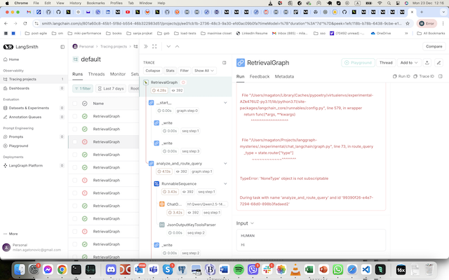
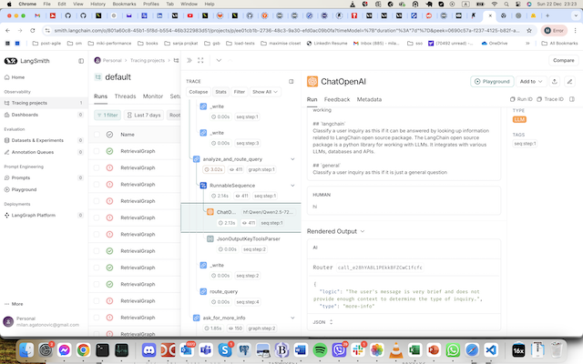
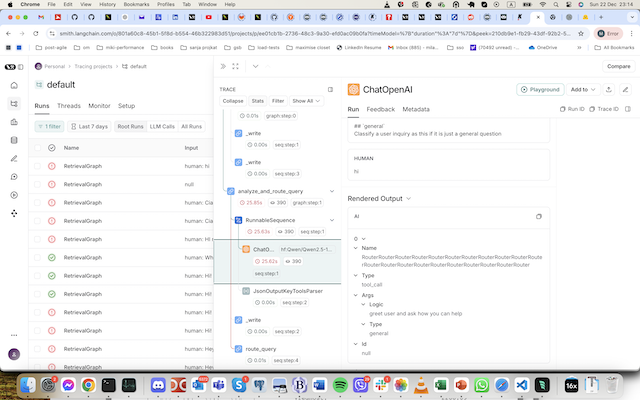
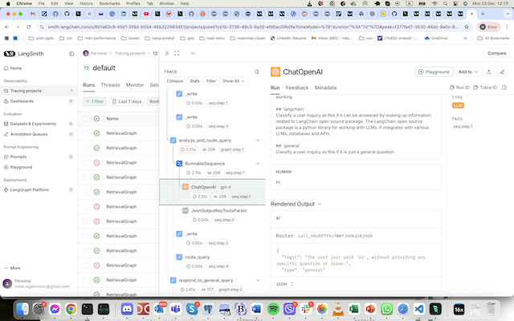

# About

I am trying to run the same graph:
chat_langchain/graph.py

with the different model providers:
- openai
- glhf

and different qwen models hosted by glhf
- qwen-14b
- qwen-72b

in 2 different ways:
- executed from my cli.py
- run with langgraph dev

And I am observing a different behaviour in both model and execution in the 1st node:
`analyze_and_route_query` when it tries to call the function `route_query` after receiving the llm response.

The error happens only in the case when I run graph with qwen2.5-14b in langgraph=studio,

[Langsmith run](https://smith.langchain.com/o/801a60c8-45b1-5f8d-b554-46b322983d51/projects/p/ee01cb1b-2736-48c3-9a30-efd0ac09b0fa?timeModel=%7B%22duration%22%3A%227d%22%7D&peek=1efc118b-b78b-6438-9cbe-e1c325bf092c)

Here are the cli logs, langgraph-studio screenshots and langsmith runs for all the models:

## qwen2.5-14b

- [qwen2.5-14b cli output](logs/qwen2.5-14b.txt)
- 
- [Langsmith run](https://smith.langchain.com/o/801a60c8-45b1-5f8d-b554-46b322983d51/projects/p/ee01cb1b-2736-48c3-9a30-efd0ac09b0fa?timeModel=%7B%22duration%22%3A%227d%22%7D&peek=1efc118b-b78b-6438-9cbe-e1c325bf092c)

## qwen2.5-72b

- [qwen2.5-72b cli output](logs/qwen2.5-72b.txt)
- 
- [Langsmith run](https://smith.langchain.com/o/801a60c8-45b1-5f8d-b554-46b322983d51/projects/p/ee01cb1b-2736-48c3-9a30-efd0ac09b0fa?timeModel=%7B%22duration%22%3A%227d%22%7D&peek=b6d9f169-0983-4d3f-b2c9-f93e631074ff)

## openai-gpt4
- [openai-gpt4 cli output](logs/openai-gpt4.txt)
- 
- [Langsmith run](https://smith.langchain.com/o/801a60c8-45b1-5f8d-b554-46b322983d51/projects/p/ee01cb1b-2736-48c3-9a30-efd0ac09b0fa?timeModel=%7B%22duration%22%3A%227d%22%7D&peek=ea1f0faf-b300-4345-9d11-7e9e72d25eb4)
